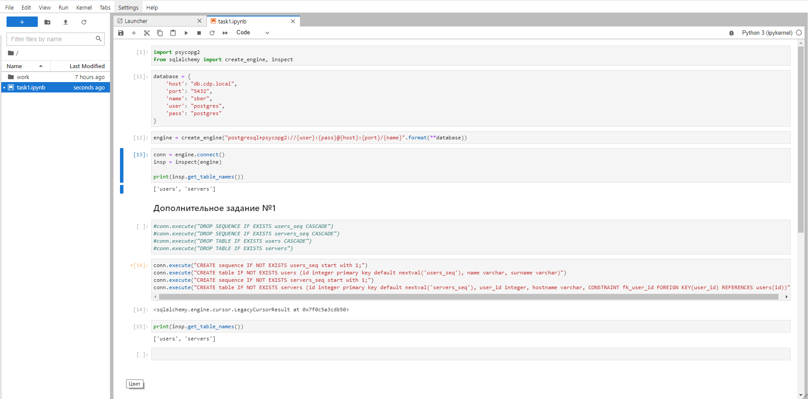

## Обязательное задание:
1. Создайте Fork к этому репозиторию
2. Ознакомтесь со структурой файла и содержимым notebook task1.ipynb
3. Подготовьте Dockerfiles, требуемые для успешной работы с notebook task1.ipynb (Для запуска notebook используйте образ JupyterLab, вместо Jupyter Notebook)
4. Составьте независимый Docker Compose file, содержающий инструкцию для развёртывания требуемых Docker Images
5. Добавьте в README.md инструкцию как? что? запускать и скрин web-интерфейса с успешным выполнением представленных ячеек notebook.
6. Откройте pull request с выполненной работой в этот репозиторий

### Порядок проверки:
1. Запустить Docker Compose file
2. Открыть JupyterLab в web-интерфейсе браузера
3. Открыть уже существующий в корне notebook task1.ipynb и запустить все ячейки
4. Jupyter не просит выбрать kernel из списка при запуске notebook. Отсутствуют ошибки и предупреждения в выводе ячеек notebook.

## Дополнительное задание №1 (необязательное, по желанию):
1. Дополните notebook task1.ipynb для выполнения запросов к базе данных из обязательного задания
2. Используя sqlAlchemy, cоздайте 2 связанные таблицы
3. Таблица 1 users(id, name, surname)
4. Таблица 2 servers(id, user_id, hostname)
5. id - auto-increment (primary key) в обоих таблицах
6. foreign key должен связывать servers.user_id и users.id
7. name, surname, hostname - любые значения

## Дополнительное задание №2 (необязательное, по желанию):
1. Дополните Docker Compose file образом Hive Standalone Metastore (версией 3.0+) работающим с использованием базы данных из обязательного задания.
2. В качестве результата добавьте в репозиторий заполненные файлы Dockerfile, hive-metastore.xml, entrypoint.sh для запуска Hive Metastore

## Запуск
1. Install docker >= 20.10.5
2. Install docker-compose >= 1.29.2
3. Istall git
4. git clone %repo%
5. cd %repo%
6. docker-compose up -d
7. После развертывания JupyterLab будет доступен по http://IP-Address

## Пример работы всех ячеек

